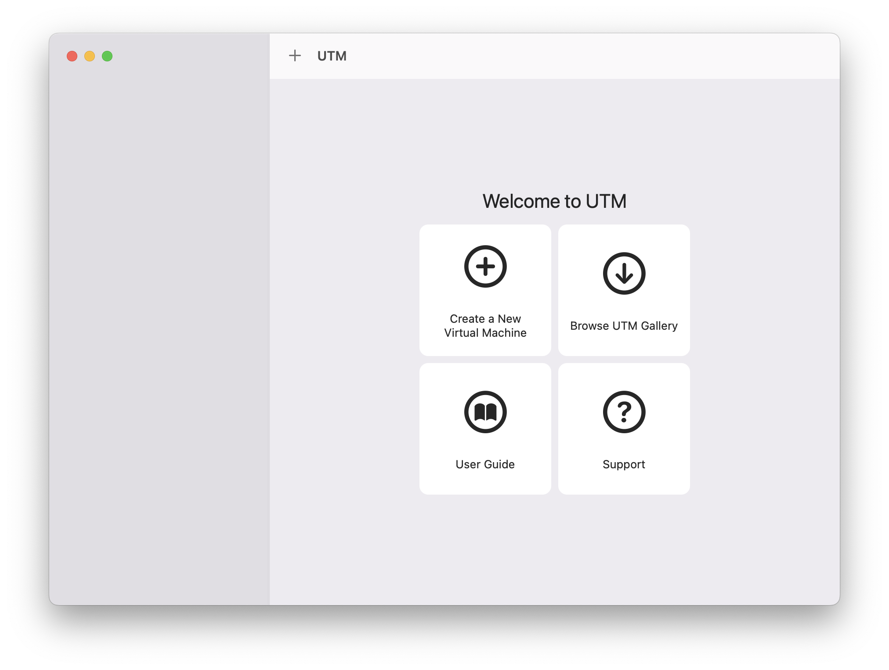

# 실습 환경 구성

Apple Silicon 라인의 프로세서에서 실습하기 위하여 UTM을 이용하여 Ubuntu를 설치하고, QEMU 에뮬레이터를 통하여 스터디를 진행하였다. 이는 책의 코드와 실행을 일치시키려는 목적도 있었고, 나아가 리눅스 커널 이해를 위한 환경 설정을 염두에 두었기 때문이다.

 아래에는 실습 환경 구성 과정을 간단하게 정리하였다.

 1. UTM 설치 : [Securely run operating systems on your Mac](https://mac.getutm.app/)
 