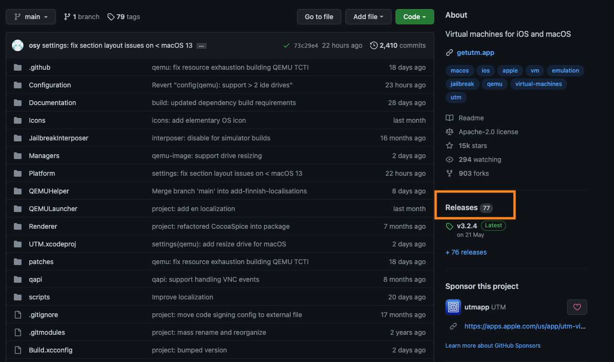
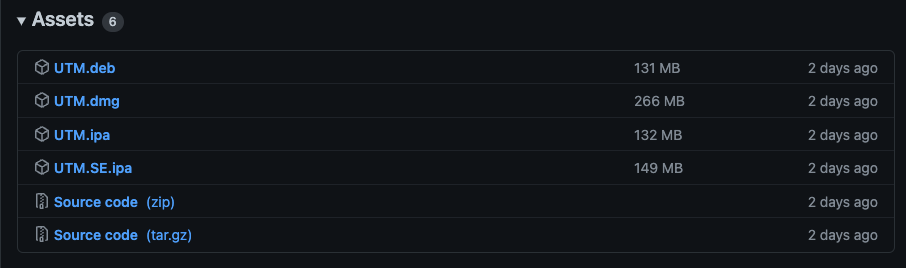
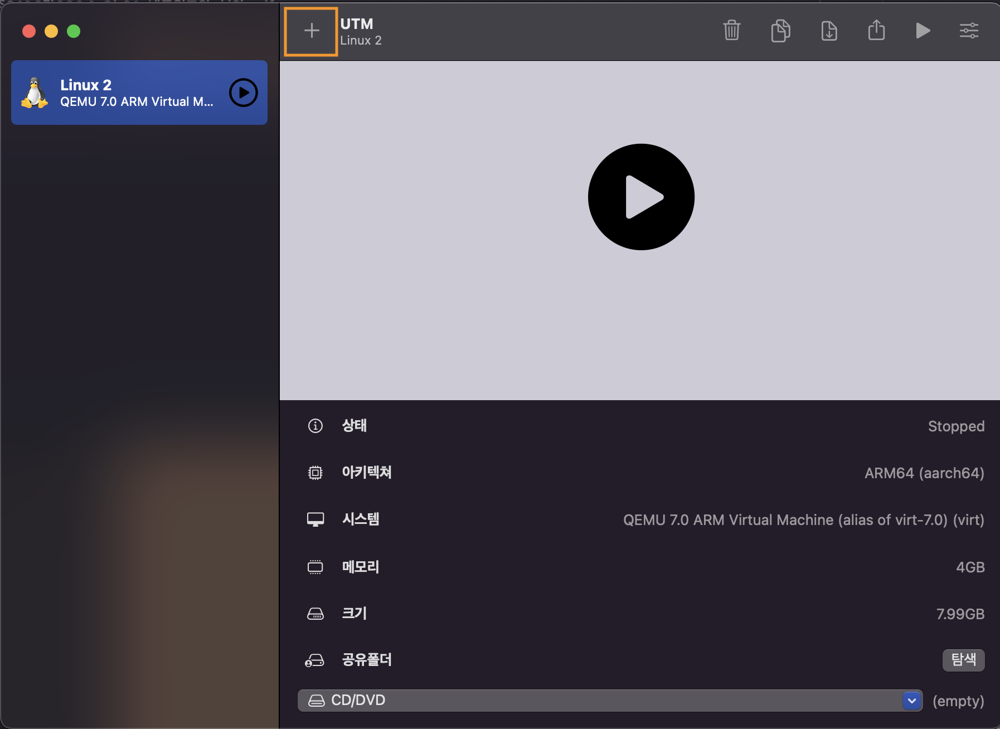
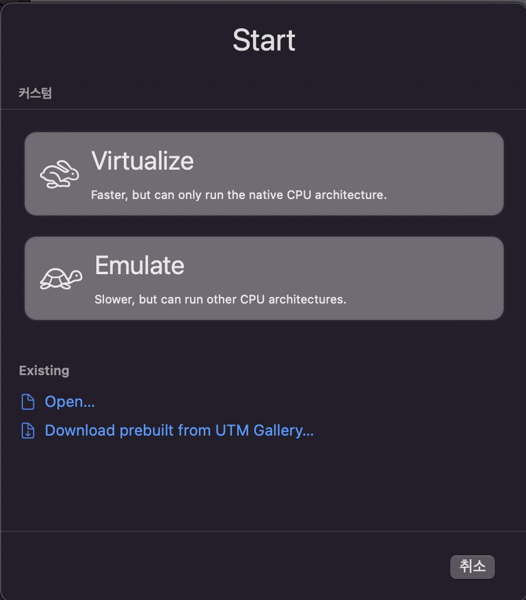
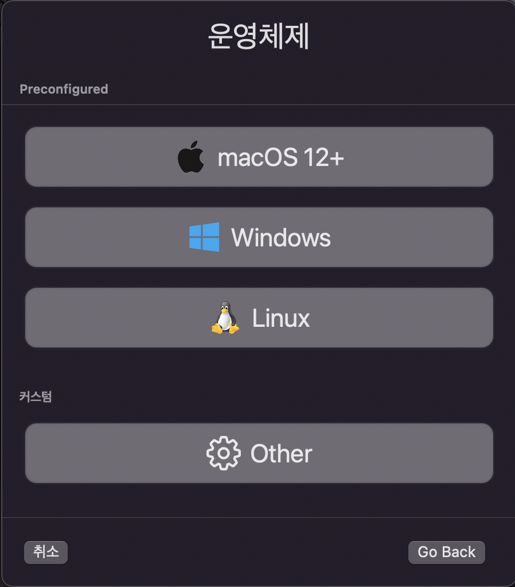
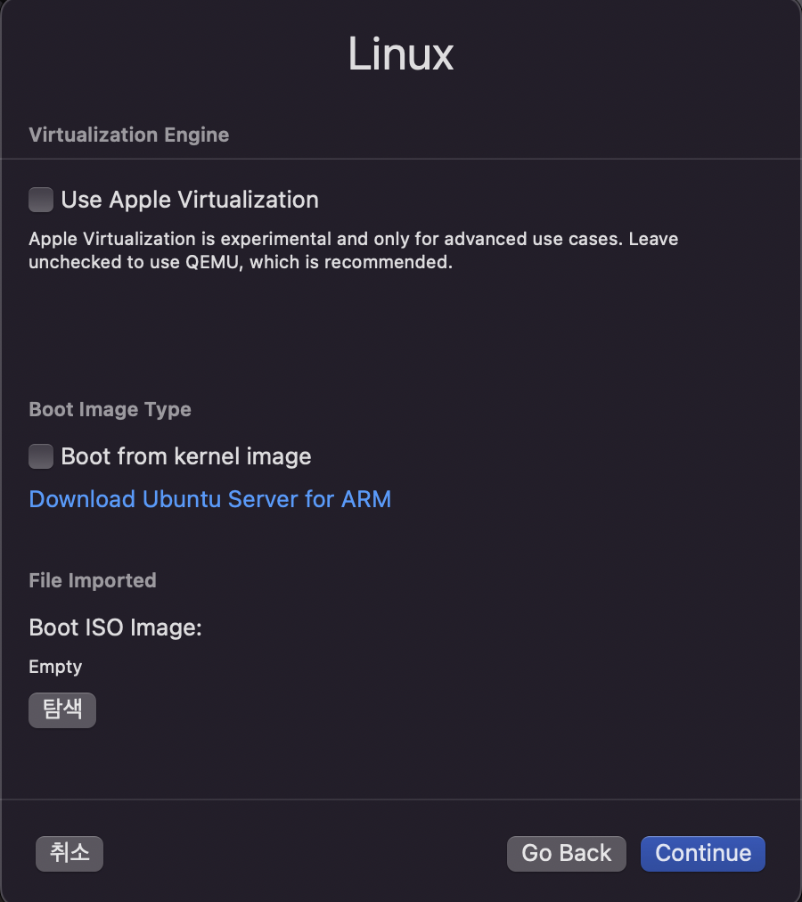
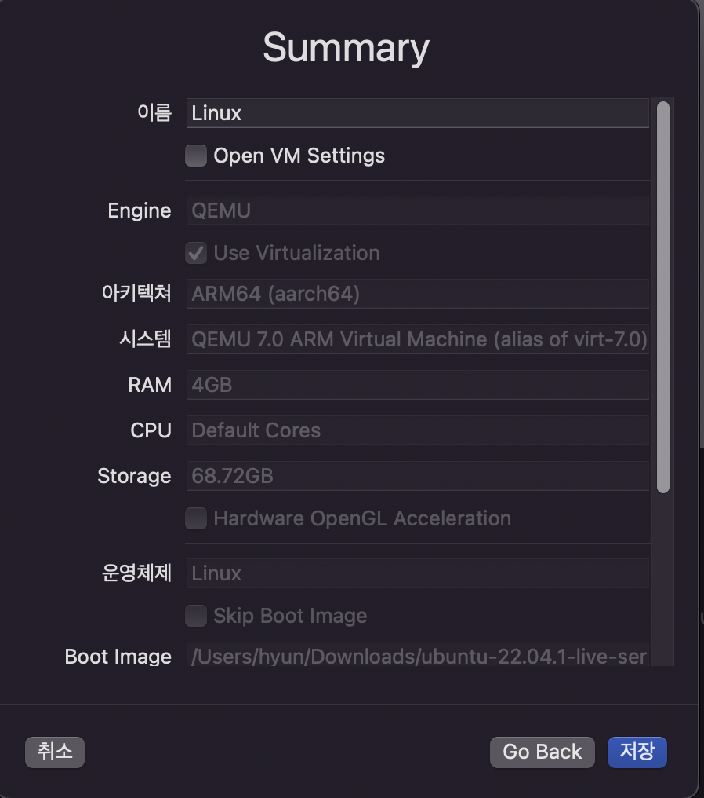

# UTM을 통한 우분투 환경 설치

## 목차

1. [UTM설치] (#1장.-UTM설치하기)

2. [Ubuntu desktop Iso이미지 파일 다운로드]

3. [UTM에서 Ubuntu 설치]

---

## 1장. UTM설치하기

### UTM이란?

- QEMU기반 시스템 에뮬레이터이자 가상 머신

- Windows, Linux, 다른 운영체제들 설치 가능

### UTM 설치하기

UTM홈페이지를 통해서 앱을 구입하고 다운로드 할 수도 있지만, beta버전을 github에서 설치할 수 있으므로 해당 방법으로 설명한다.

1. [UTM github](https://github.com/utmapp/UTM) 접속

2. Releases 페이지로 이동
   
   

3. 각 버전별 release note에서 Assets항목으로 이동 후 패키지 다운로드 한다.
   
   - 해당 문서에서는 4.0.3버전으로 설치
   
   

## 2장. Ubuntu desktop Iso이미지 파일 다운로드

기본적으로 ubuntu desktop을 검색하여 lts버전을 다운로드하면 큰 문제가 없지만, 애플 실리콘 m1등의 arm을 사용하는 경우 arm iso 이미지를 다운로드 받는다.

[arm iso 이미지 링크](https://cdimage.ubuntu.com/focal/daily-live/current/)

## 3장. UTM에서 Ubuntu 설치

### 새 에뮬레이터 추가

- +버튼을 눌러서 시작한다.

- Virtualize와 emulate 중 선택할 수 있는데, 개발 용도로도 사용할 것이기 때문에 Virtualize를 선택한다.

- Ubuntu Linux를 설치할 것이므로 Linux 선택

- QEMU를 사용할 것이므로 Use Apple Virtualization은 선택하지 않고, ISO이미지를 다운로드 받았으므로 Boot from kernel Image또한 선택하지 않는다.

- 아래의 탐색 버튼을 클릭해서 ubuntu desktop의 iso 이미지를 선택한다.

- 메모리는 사용중인 컴퓨터의 반 이하로 설정하고, Storage크기는 용도에 따라서 설정한다. 

- 공유 폴더는 가상 머신과 공유할 폴더를 설정하는 것인데, 따로 설정하지 않는다.

- 그 이후 이름을 설정하고 저장 후 가상머신을 실행하면 우분투 설치를 진행할 수 있다.

